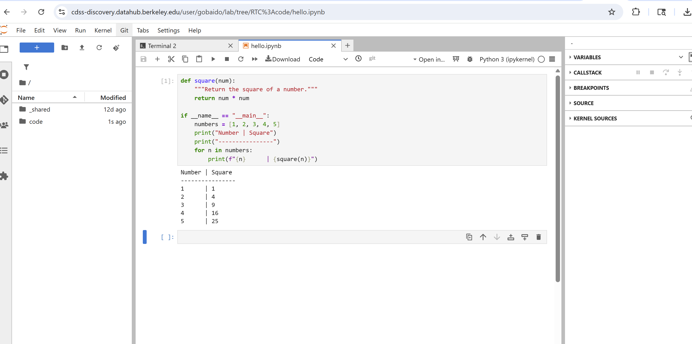

👉 You can write your code directly in a notebook **cell**.  
To add multiple cells, click the **"+"** button at the top of the Jupyter interface.

This example demonstrates how to define a simple function in Python to compute the square of a number, and then use it to print the squares of the numbers 1 through 5.

## Code

```python
def square(num):
    """Return the square of a number."""
    return num * num

if __name__ == "__main__":
    numbers = [1, 2, 3, 4, 5]
    print("Number | Square")
    print("---------------")
    for n in numbers:
        print(f"{n}      | {square(n)}")
