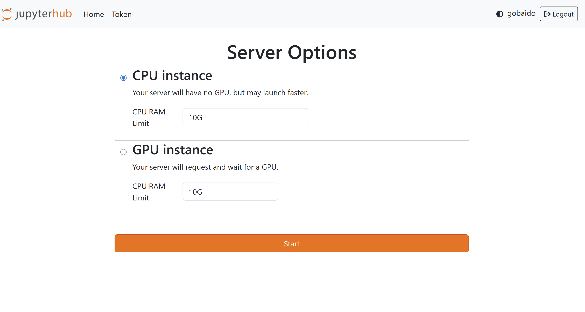

When you log in to the CDSS DataHub (JupyterHub), you will see the **Server Options** page. This is where you decide how your computing environment will be set up.

You will have two main choices:

### **CPU instance**
- Your server will not have a GPU, but it will typically launch faster.  
- Best suited for:
  - Data cleaning and preprocessing
  - Exploratory data analysis
  - Running small to medium computations
- You can set the **CPU RAM limit** (default: `10G`).

### **GPU instance**
- Your server will request and wait for a GPU. Launch time may be longer due to limited availability.  
- Best suited for:
  - Training machine learning and deep learning models
  - Large-scale parallel computations
  - Tasks requiring GPU acceleration (e.g., TensorFlow, PyTorch)
- You can also set the **CPU RAM limit** (default: `10G`).

---

👉 **Tip:**  
Start with a **CPU instance** unless your project specifically requires GPU resources.  
Once you’ve made your choice, click the **Start** button to launch your server.
