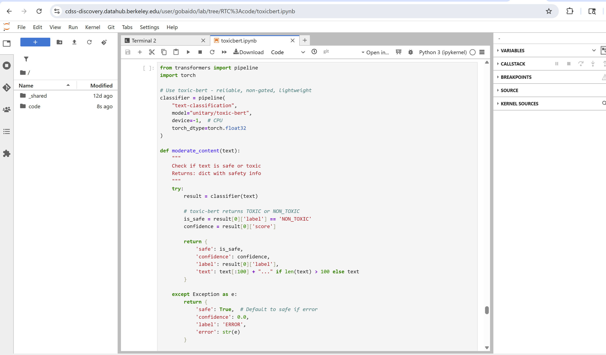

You can run **Large Language Models (LLMs)** directly in notebooks using the 
[Hugging Face Transformers](https://huggingface.co/docs/transformers/index) library.  
This makes it easy to experiment with text classification, text generation, 
and other natural language processing (NLP) tasks.

### Tips for Using LLMs on DataHub

- Prefer **non-gated models** like `distilgpt2`, `TinyLlama`, or `unitary/toxic-bert` if you don’t need advanced capabilities.  
- If you need **gated models** (e.g., *LLaMA*, *Gemma*), you must request access on Hugging Face and use your personal token.  
- Start with **CPU instances** for smaller models; switch to **GPU instances** if training or running large models.  
- If you run into **space or storage issues**, please let us know so we can help extend your resources.  

### Example: Content Moderation with `toxic-bert`
The example below uses the lightweight, non-gated model `unitary/toxic-bert` 
to classify text as either **TOXIC** or **NON_TOXIC**.


```python
from transformers import pipeline
import torch

# Use toxic-bert - reliable, non-gated, lightweight
classifier = pipeline(
    "text-classification", 
    model="unitary/toxic-bert",
    device=-1,  # CPU
    torch_dtype=torch.float32
)

def moderate_content(text):
    """
    Check if text is safe or toxic
    Returns: dict with safety info
    """
    try:
        result = classifier(text)
        
        # toxic-bert returns TOXIC or NON_TOXIC
        is_safe = result[0]['label'] == 'NON_TOXIC'
        confidence = result[0]['score']
        
        return {
            'safe': is_safe,
            'confidence': confidence,
            'label': result[0]['label'],
            'text': text[:100] + "..." if len(text) > 100 else text
        }
    
    except Exception as e:
        return {
            'safe': True,  # Default to safe if error
            'confidence': 0.0,
            'label': 'ERROR',
            'error': str(e)
        }
# Test cases
test_messages = [
    "How do I terminate a process in Linux?",
    "What are some good programming practices?",
    "Can you help me with my homework?",
    "How to cook pasta?",
    "Explain machine learning concepts",
    "How can I destroy a computer?"
]

print("Content Moderation Results:")
print("-" * 50)

for msg in test_messages:
    result = moderate_content(msg)
    status = "✅ SAFE" if result['safe'] else "❌ UNSAFE"
    print(f"{status} | Confidence: {result['confidence']:.3f} | {result['text']}")

