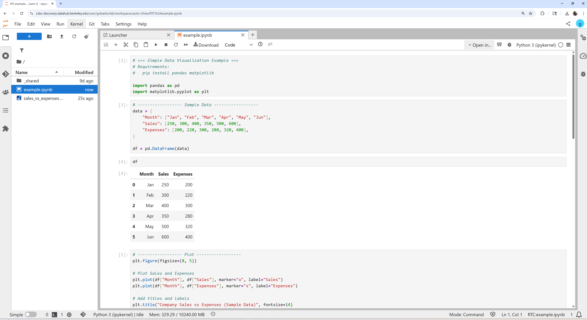

Once your environment is ready, you can start writing Python code in notebooks.  
Here’s an example of how to create a simple dataset and plot it using **Pandas** and **Matplotlib**.



### **Example: Sales vs Expenses**
```python
# === Simple Data Visualization Example ===
# Requirements:
#   pip install pandas matplotlib

import pandas as pd
import matplotlib.pyplot as plt

# ---------------- Sample Data ----------------
data = {
    "Month": ["Jan", "Feb", "Mar", "Apr", "May", "Jun"],
    "Sales": [250, 300, 400, 350, 500, 600],
    "Expenses": [200, 220, 300, 280, 320, 400],
}

df = pd.DataFrame(data)

# Display the DataFrame
df

plt.figure(figsize=(8, 5))

# Plot Sales and Expenses
plt.plot(df["Month"], df["Sales"], marker="o", label="Sales")
plt.plot(df["Month"], df["Expenses"], marker="s", label="Expenses")

# Add titles and labels
plt.title("Company Sales vs Expenses (Sample Data)", fontsize=14)
plt.xlabel("Month")
plt.ylabel("Value (USD)")
plt.legend()
plt.grid(True)

plt.show()
