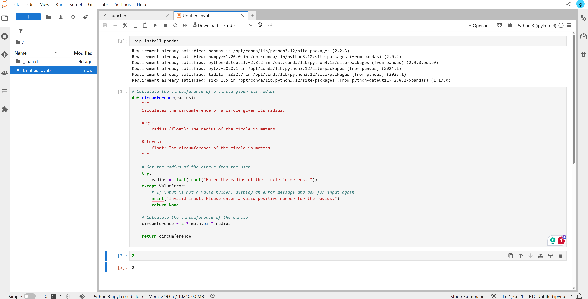

Most common Python libraries such as **NumPy**, **Pandas**, **Matplotlib**, **Scikit-learn**, **TensorFlow**, and **PyTorch** are already installed on the CDSS DataHub.  
However, if you need to use an additional library, you can install it yourself.



### **Option 1: Install in a Notebook Cell**
You can install a package by running the following command inside a notebook cell (note the exclamation mark `!` before `pip`):

```python
!pip install pandas
