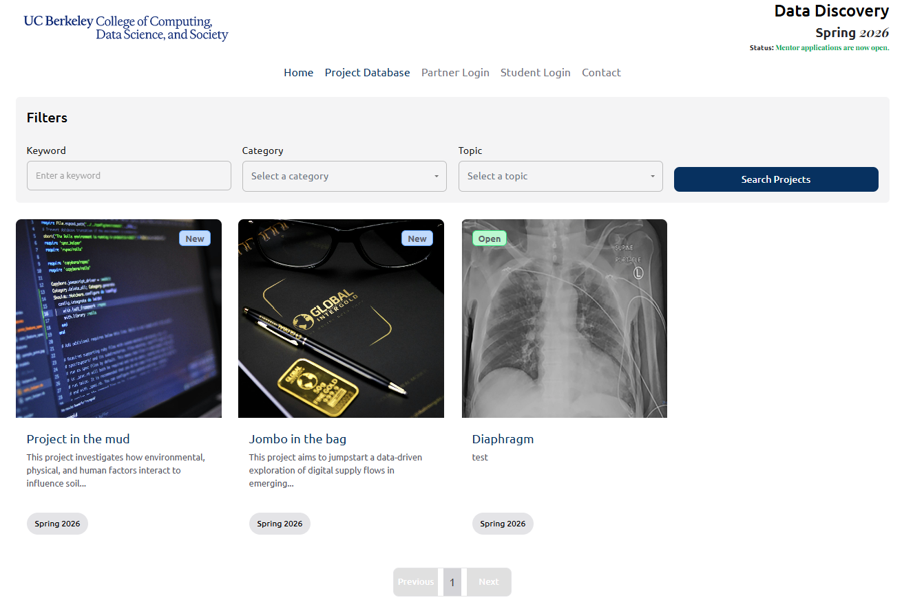
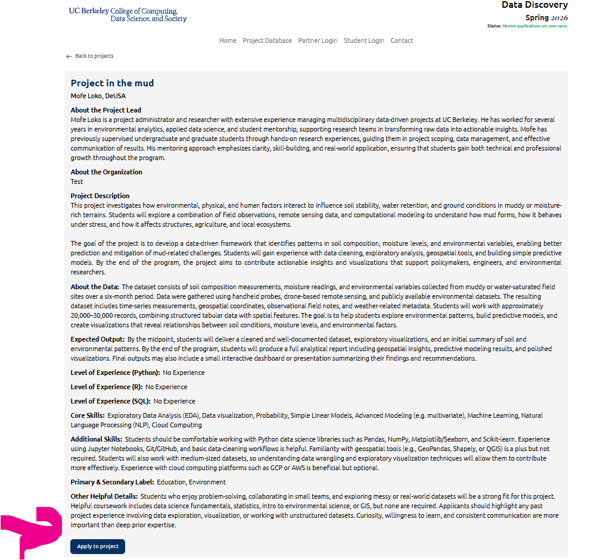
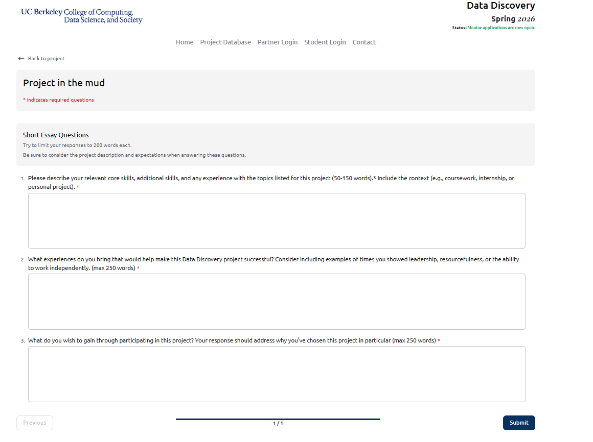

## Step 1: Find a project on the homepage
Go to the **Project Database**. Use **Keyword**, **Category**, or **Topic** filters (optional), then click a project card to open details.

---

## Step 2: Review the project and start your application
Read the full description (organization, goals, data, skills). When ready, click **Apply to project** at the bottom.

---

## Step 3: Complete the short essay questions and submit your application
On the application page, respond to the three short essay prompts:

1. **Describe your core and additional skills** relevant to the project (50–150 words).  
2. **Explain what experiences you bring** that would help make the project successful (max 250 words).  
3. **Share what you hope to gain** from participating in this specific project and why you chose it (max 250 words).

When all fields are complete, click **Submit** to finish your application.

**Note:** You may apply to **up to 10 projects per term**.  
Repeat this process for any additional projects you would like to be considered for.