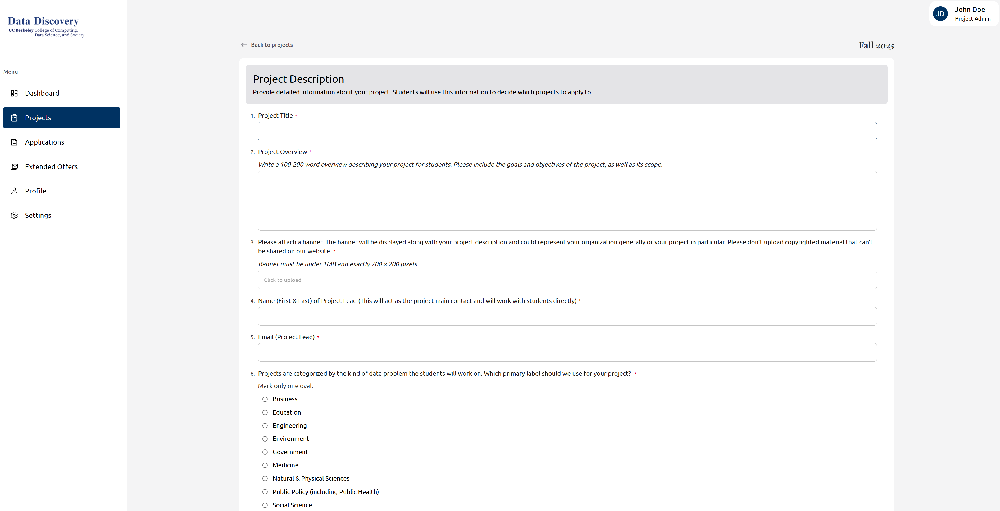
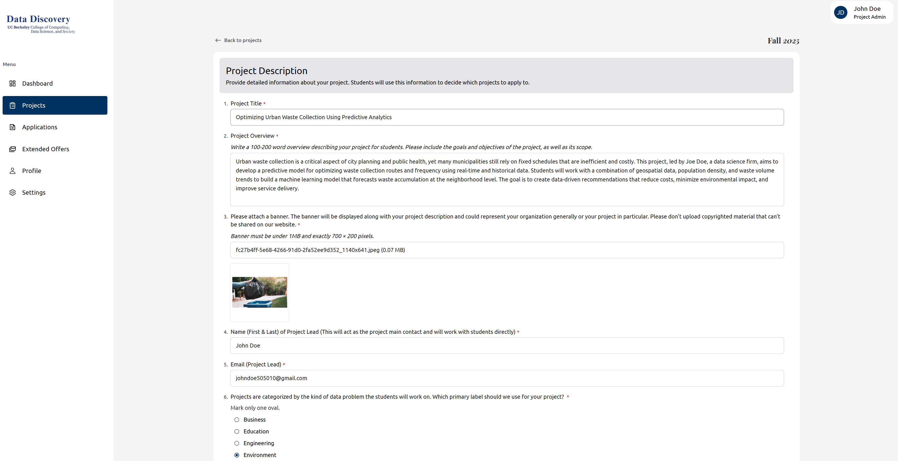
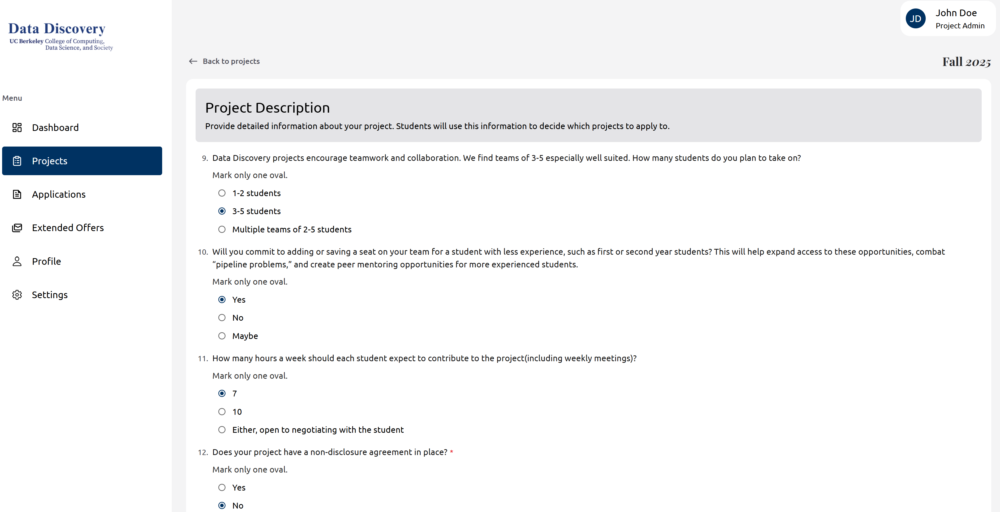
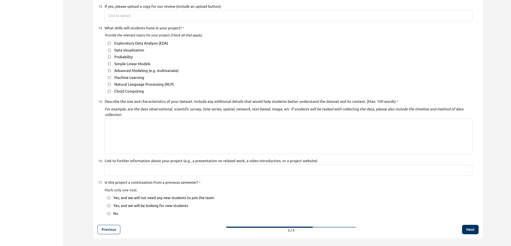
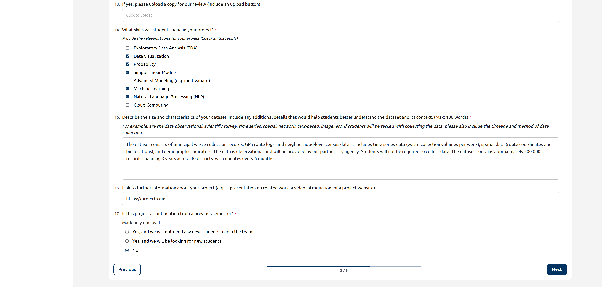
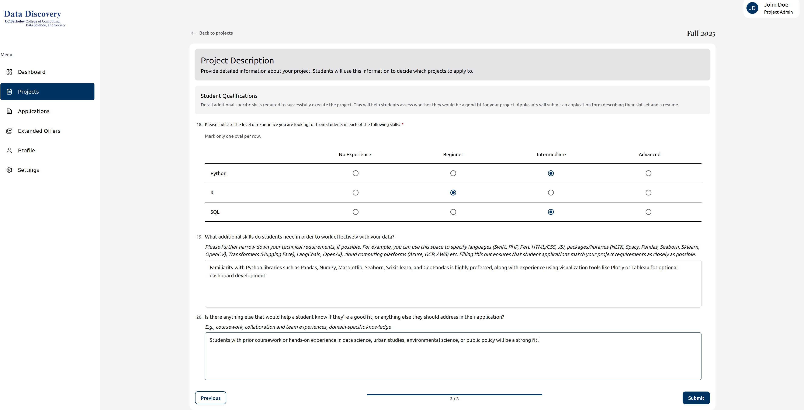

This guide walks partners through the steps required to successfully submit a project on the DD Match platform.

---

## Step 1: Navigate to the Projects Tab

Once logged in, click the **“Projects”** tab on the left-hand menu. Then click the **“Create Project”** button on the top-right corner.

---

## Step 2: Add Basic Project Information

Enter your **Project Title**, a short **Project Overview**, upload a banner image (under 1MB, 700×200px), and provide your **Name** and **Email**.

---

## Step 3: Choose Categories

Select the **primary** and **secondary label** that best categorize your project (e.g., Environment, Engineering, Public Policy, etc.).

---

## Step 4: Define Deliverables

Describe the tangible outcomes students will produce over the semester. Include things like reports, dashboards, models, or presentations.

---

## Step 5: Project Scope

Indicate whether this is a **new or continuing project**, and provide a link to any related materials (website, deck, prior semester project).

---

## Step 6: Dataset Description

Describe the **type, size, and structure of your dataset**. Include whether it’s observational, spatial, time-series, etc., and note if students will need to collect it.

---

## Step 7: Skills Students Will Develop

Check the skills students will learn through this project (e.g., EDA, NLP, ML, data visualization).

---

## Step 8: Technical Requirements

Specify which skills or tools students should be familiar with (e.g., Python, SQL, Tableau, Hugging Face, AWS). Also add any helpful background knowledge.

---

## Step 9: Final Review and Submit

Review your inputs and click **Submit** to publish your project to the platform. Students will now be able to view and apply.

> ✅ Congratulations! Your project has been successfully submitted for consideration and will undergo review by the Data Discovery Program Team. Please await further communication regarding the status of your submission.

> Once approved, your project will appear in the student-facing portal, where eligible students can apply to join your team. In the meantime, you may return to your dashboard to monitor progress, update project details, or manage your profile.

> If you have any questions, feel free to contact cdss-datadiscovery@berkeley.edu.