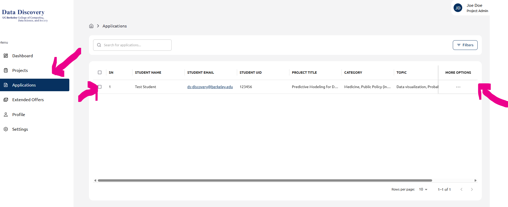
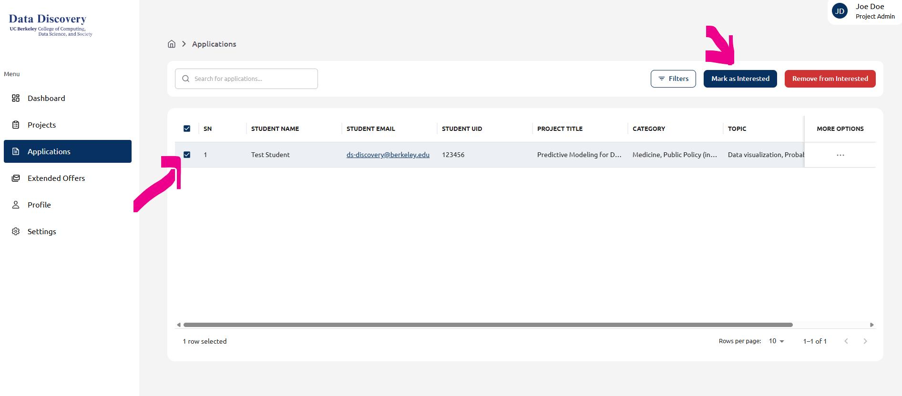
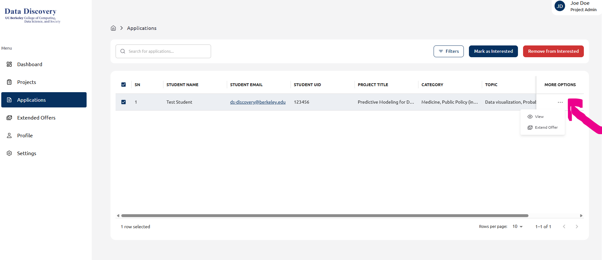
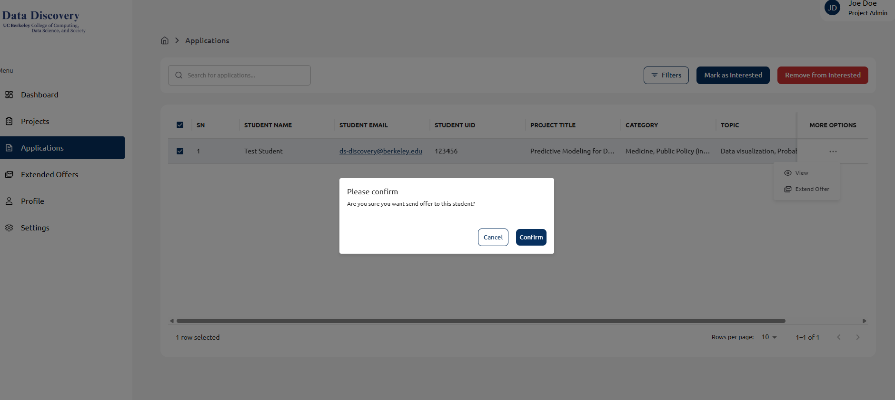

## Step 1: Open Applications
From your Dashboard, go to **Applications**. Select the candidate’s row, then click the **More options (⋯)** menu on the far right.

---

## Step 2: Choose “Extend Offer”
With the candidate selected, open the **More options (⋯)** menu and click **Extend Offer**.

---

## Step 3: Confirm the offer
A confirmation dialog will appear. Click **Confirm** to send the offer to the student (or **Cancel** to go back).

---

## Step 4: Mark as Interested (optional)
You can also mark the student as **Interested** to track promising candidates while you finalize decisions.

