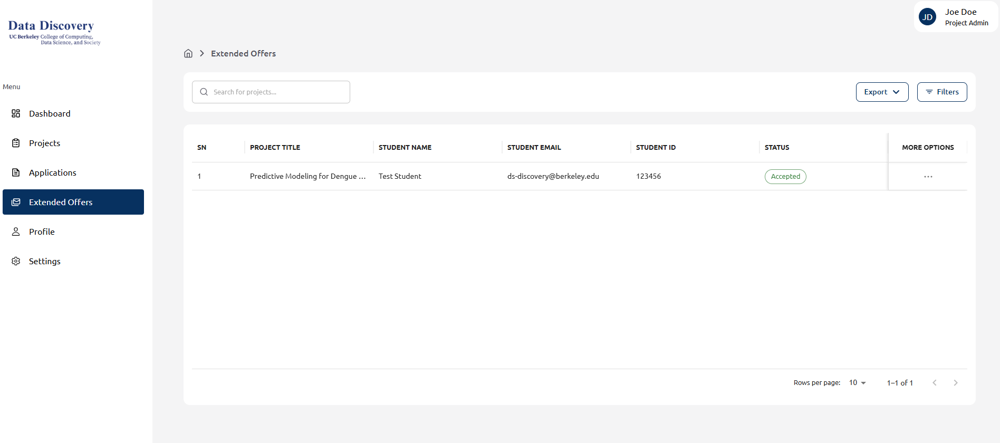

## Step: Review your accepted offers

Go to the **Extended Offers** tab to see a list of students who have received offers for your projects. The table shows the **Project Title**, **Student Name**, **Student Email/ID**, and the current **Status** (e.g., *Accepted*). Use **Filters** or **Export** if needed.

