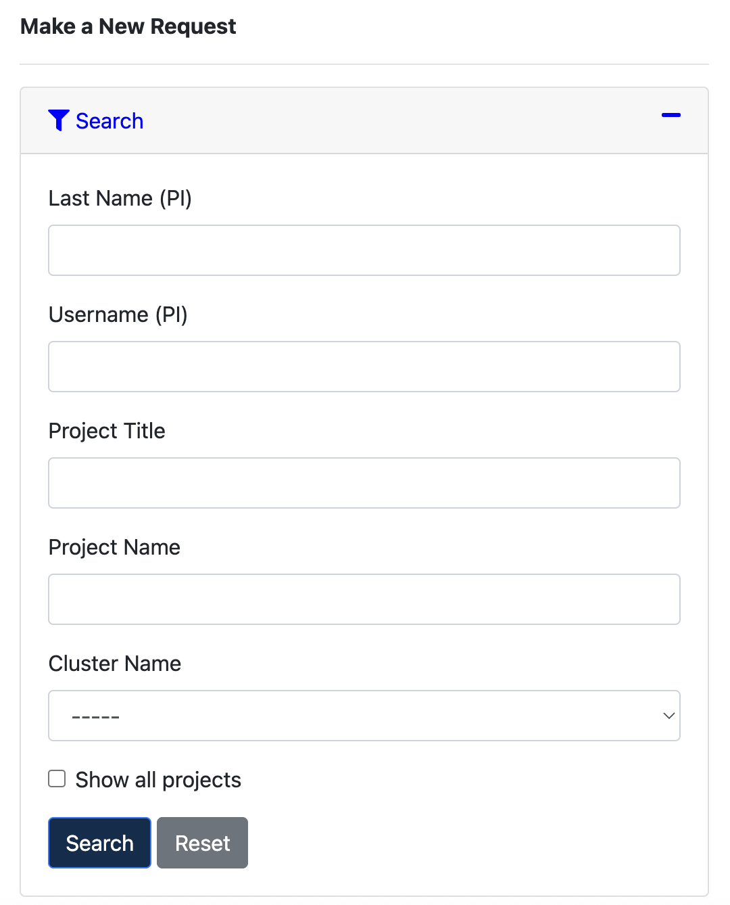

## Request an Account

1. Visit the [MyBRC portal](https://mybrc.brc.berkeley.edu/) and log in. Most people should choose CalNet, including CalNet Sponsored Guests. External collaborators can choose **Other** and then **External Collaborator**.
1. If this is your first time creating an account, you must complete the **Sign the cluster user access agreement** task before you can join a project.
1. Click [My BRC Cluster Projects](https://mybrc.brc.berkeley.edu/project/), then [Join a project](https://mybrc.brc.berkeley.edu/project/join/).
1. Click `Search` and search for `pc_cdssdisc` in the *Project Name* field.



1. Click `Join` on the project entry.

## Logging in

1. Ensure that you've set up one-time password authentification. Follow the instructions to do so [here](https://docs-research-it.berkeley.edu/services/high-performance-computing/user-guide/setting-otp/).
2. Open your terminal/SSH program and connect to the Savio cluster via SSH using the command: 
- Run:
```bash
ssh yourusername@hpc.brc.berkeley.edu
```
- Use the Data Transfer Node dtn.brc.berkeley.edu for data transferring!

3. At the Password prompt, enter your token PIN, followed immediately by the 6-digit one-time password displayed in your Google Authenticator app. ex. if your PIN was `9999` and your OTP was `123456`, you would enter `Password: 9999123456`.